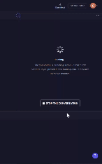
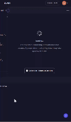
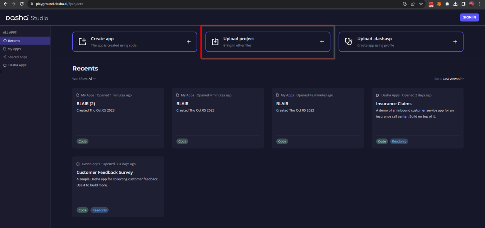

<h1 align="center">
  Dasha AI Call Center
</h1>

<p align="center">
  <a href="#about">About</a> •
  <a href="#preview">Preview</a> •
  <a href="#features">Features</a> •
  <a href="#usage">Usage</a>
</p>

<h2 id="about">About</h2>
<p>
<strong><a href="https://dasha.ai">Dasha</a></strong> is a conversational-AI-as-a-service platform that lets you embed realistic voice and text conversational capabilities into your apps or products. <br />

In other words, with a single integration, you can create smart conversational apps for web, desktop, mobile, IoT and call centers.

</p>

<h2 id="preview">Preview</h2>

#### Primary test



#### Interruption test



<h2 id="features">Features</h2>

- Text
- Voice

<h2 id="usage">Usage</h2>

<p><b>1.</b> Access the project folder in the command line</p>

```bash
$ git clone https://github.com/BestHappy90619/Dasha-AI-Call-Center.git
```

<p><b>2.</b> Load the project</p>


